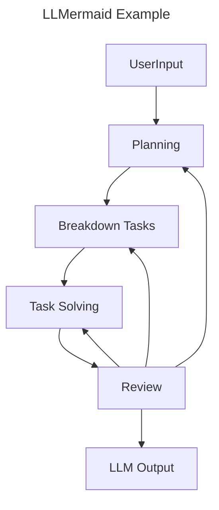

# llmermaid

```mermaid
---
title: LLMermaid Example
---
flowchart TD
  A[UserInput] --> B[Planning]
  B --> C[Breakdown Tasks]
  C --> D[Task Solving]
  D --> E[Review]
  E --> B
  E --> C
  E --> D
  E --> F[LLM Output]
```
