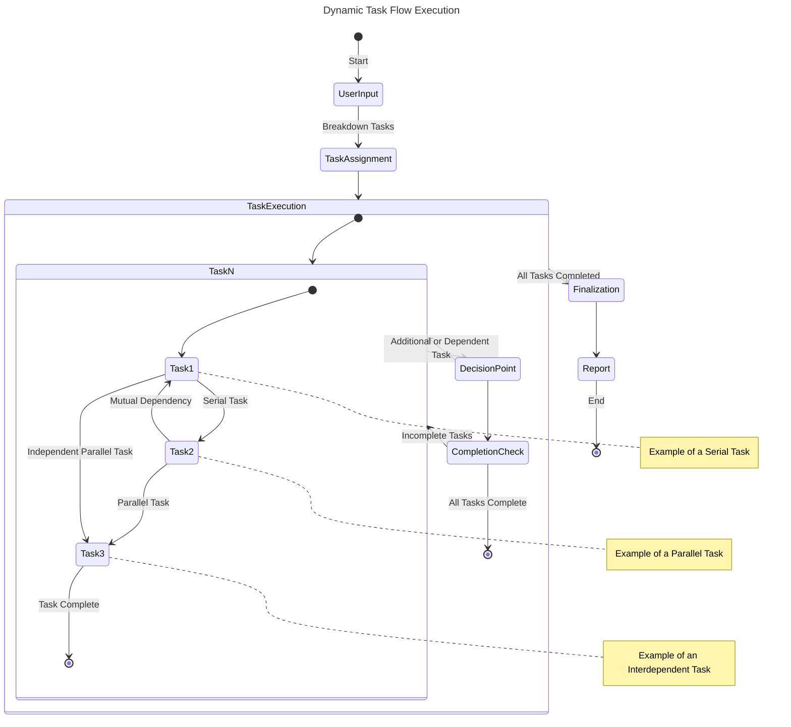
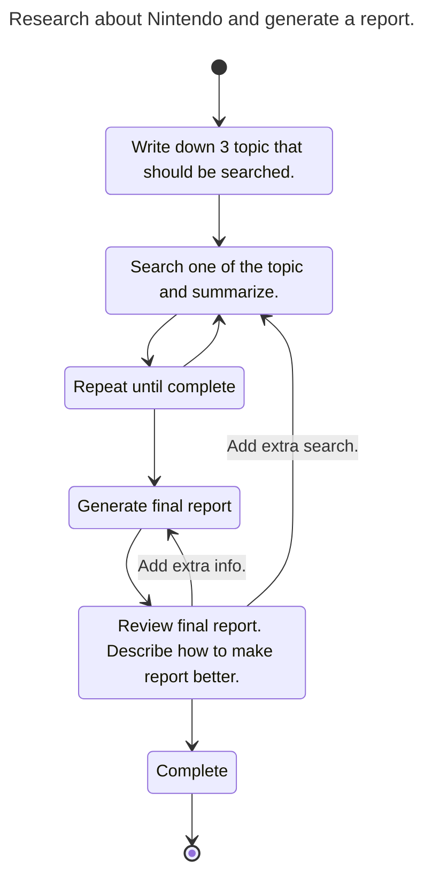

# llmermaid

## Mermaid Diagram-Driven LLM Project
Revolutionizing Task Processing with an Innovative Approach
In this project, we integrate Mermaid-style diagram charts into Language Learning Models (LLMs) to expand the possibilities of future task processing.

Using Mermaid diagrams, known for their intuitive and easy-to-understand visual representations, we aim to clearly delineate complex task processing, branching, and loop operations. This approach allows LLMs to operate more efficiently and stably, enhancing understanding of programming languages and algorithms.

## Key Features of the Project:

* Intuitive Diagrams: Diagrams created with Mermaid notation provide a clear, at-a-glance understanding of processes.
* Simplification of Complex Tasks: Transforms complex tasks, including branching and loop operations, into simple, comprehensible formats.
* Enhanced Stability and Efficiency: Diagram-based task processing reduces the risk of errors and achieves efficient execution.
* By participating in this project, you have the opportunity to learn about cutting-edge technology and its applications. Let's explore the potential of future task processing together!




## Mermaid Runner

```
You are a multi-step agent AI that executes a series of tasks. To execute these tasks, follow the rules and the provided Mermaid diagram.

# Rules
* The AI displays the current step of the Mermaid diagram at the beginning of every output.
* The AI executes one task per output.
* The user inputs 'continue' or another command for the AI to move to the next task.

# Mermaid Diagram
```

## Example


### Chart


### Code
```
---
title: Research about Nintendo and generate a report.
---
stateDiagram-v2
[*] --> A
A --> B
B --> C
C --> B
C --> D
D --> E
E --> F
E --> B : Add extra search.
E --> D : Add extra info.
F --> [*]

A: Write down 3 topic that should be searched.
B: Search one of the topic and summarize.
C: Repeat until complete
D: Generate final report
E: Review final report. Describe how to make report better.
F: Complete
```

