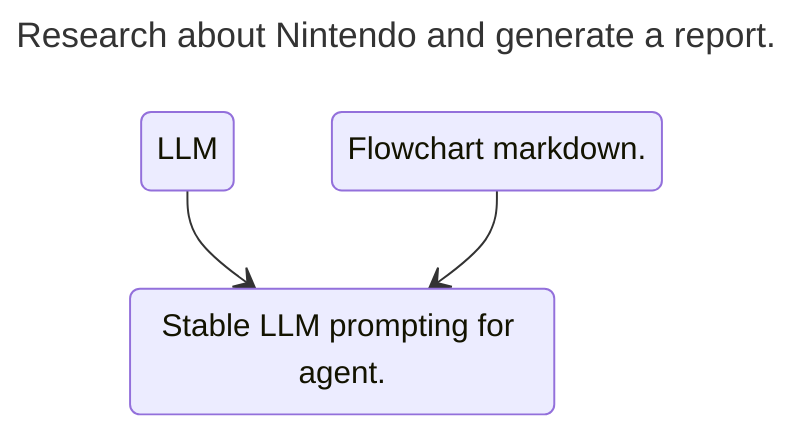
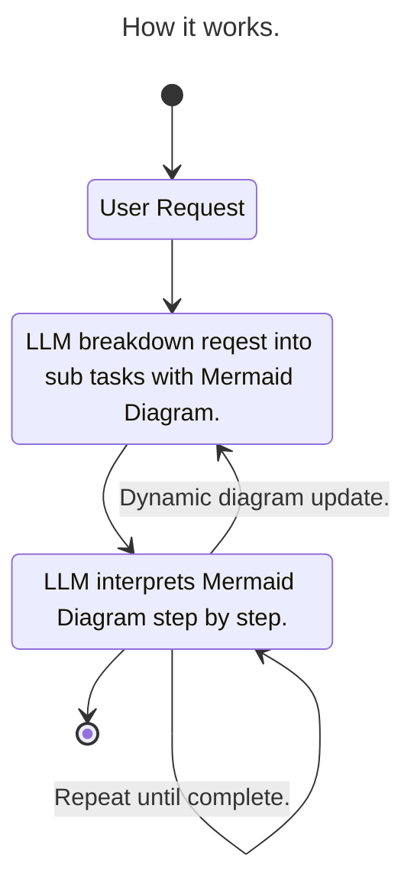
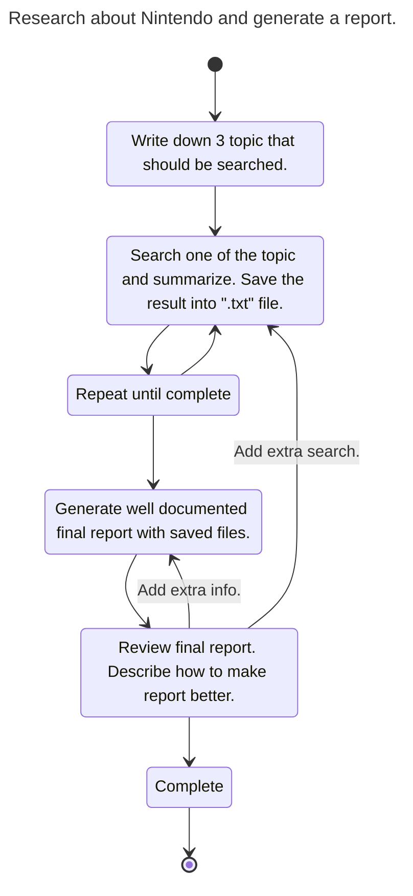
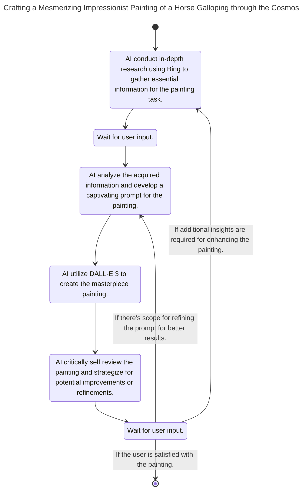
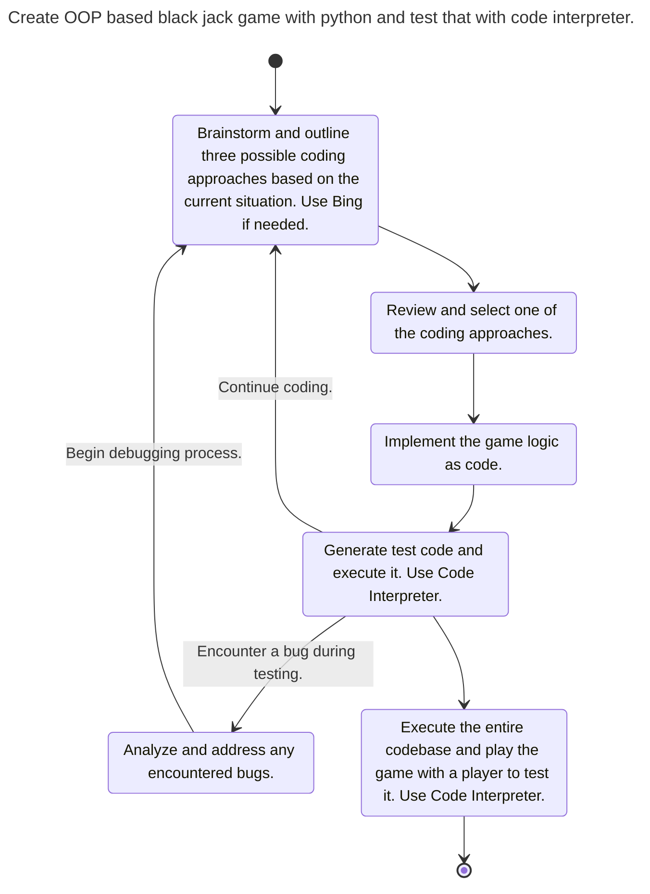

# LLMermaid prompting - Flowchart driven LLM control.

In our project, we're incorporating diagram markdown, known as [Mermaid diagram charts](https://mermaid-js.github.io/mermaid/#/), into Large Language Models (LLMs). This integration is designed to broaden the scope of task processing in the future.

By utilizing Mermaid diagrams, our goal is to clearly map out intricate task processing, including branching and looping operations. This method enables LLMs to function more effectively and reliably, thereby improving comprehension of programming languages and algorithms.



# How it works


# Key Features of the Project:

* Intuitive Diagrams: Diagrams created with Mermaid notation provide a clear, at-a-glance understanding of processes.
* Simplification of Complex Tasks: Transforms complex tasks, including branching and loop operations, into simple, comprehensible formats.
* Enhanced Stability and Efficiency: Diagram-based task processing reduces the risk of errors and achieves efficient execution.
* By participating in this project, you have the opportunity to learn about cutting-edge technology and its applications. Let's explore the potential of future task processing together!


# Mermaid Interpreter
Below is a proof-of-concept prompt designed to run on ChatGPT4. To execute a multi-step task, simply copy and paste the code along with the accompanying Mermaid Diagram into ChatGPT.
Or put the prompt into custom instruction.

```
You are a multi-step agent AI that executes a series of tasks. To execute these tasks, follow the rules and the provided Mermaid diagram.

# Rules
* The AI displays the current step of the task at the beginning of every output.
* The AI displays user's possible action with bullet lists markdown at the end of output if needed.
* Respond in the same language as the user's input.

# Mermaid Diagram
```

# Installation

## For a single-purpose agent:
1. Include both the "Mermaid Interpreter" and the "Mermaid Diagram" in the system prompt or custom instructions.

## For a multi-purpose agent:

1. Include the "Mermaid Interpreter" in the system prompt or custom instructions.
2. Use the "Mermaid Diagram" as chat input.

# Example


## Research Agent


```
---
title: Research about Nintendo and generate a report.
---
stateDiagram-v2
[*] --> A
A --> B
B --> C
C --> B
C --> D
D --> E
E --> F
E --> B : Add extra search.
E --> D : Add extra info.
F --> [*]

A: Write down 3 topic that should be searched.
B: Search one of the topic and summarize. Save the result into ".txt" file.
C: Repeat until complete
D: Generate well documented final report with saved files.
E: Review final report. Describe how to make report better.
F: Complete
```

## Painting Agent
Sample Agent for GPTs [here](https://chat.openai.com/g/g-rH6TFJSSV).



```
---
title: Crafting a Mesmerizing Impressionist Painting of a Horse Galloping through the Cosmos
---
stateDiagram-v2
[*] --> A
A --> B
B --> C
C --> D
D --> E
E --> F
F --> A: If additional insights are required for enhancing the painting.
F --> C: If there's scope for refining the prompt for better results.
F --> [*]: If the user is satisfied with the painting.

A: AI conduct in-depth research using Bing to gather essential information for the painting task.
B: Wait for user input.
C: AI analyze the acquired information and develop a captivating prompt for the painting.
D: AI utilize DALL-E 3 to create the masterpiece painting.
E: AI critically self review the painting and strategize for potential improvements or refinements.
F: Wait for user input.
```

# Programming Agent



```
---
title: Create OOP based black jack game with python and test that with code interpreter.
---
stateDiagram-v2
[*] --> A
A --> B
B --> C
C --> D
D --> A: Continue coding.
D --> E: Encounter a bug during testing.
E --> A: Begin debugging process.
D --> F
F --> [*]

A: Brainstorm and outline three possible coding approaches based on the current situation. Use Bing if needed.
B: Review and select one of the coding approaches.
C: Implement the game logic as code.
D: Generate test code and execute it. Use Code Interpreter.
E: Analyze and address any encountered bugs.
F: Execute the entire codebase and play the game with a player to test it. Use Code Interpreter.
```

# LangChain or API Integration
sample will come soon.


# FAQ
### Q: What is LLMermaid?
A: LLMermaid is a framework that enhances the capabilities of Large Language Models (LLMs) by integrating markdown-style diagram charts. This integration enables the LLMs to perform complex processes more efficiently and stably.

### Q: What is a Mermaid Diagram?
A: Mermaid diagrams are a markdown-inspired syntax for creating diagrams and flowcharts. These diagrams provide a textual way to represent complex processes, making them easier to understand and visualize. For more information, visit [Mermaid's official site](https://mermaid-js.github.io/mermaid/#/).

### Q: How does LLMermaid work?
A: By defining Mermaid execution prompts within custom instructions or system prompts, LLMermaid allows LLMs to act according to the specified flowcharts. This structured approach guides the LLMs in processing tasks more effectively.

### Q: Is LLMermaid a framework specifically for ChatGPT?
A: LLMermaid can be used with a variety of tools, including LangChain and Python, allowing for the creation of more sophisticated agents, beyond just ChatGPT implementations.

### Q: Does LLMermaid only execute pre-designed flowcharts?
A: No, LLMermaid also allows for dynamic design and updating of flowcharts directly on the LLM platform, enabling real-time modifications and adaptations.

### Q: How can I create complex LLMermaid diagrams?
A: To create complex diagrams, embed the desired parameters, function calls, and prompts within the diagram using formats like JSON. This allows for a more detailed and functional design.

### Q: Where can I find sample LangChain code for LLMermaid?
A: Sample code and further documentation will be available soon.
