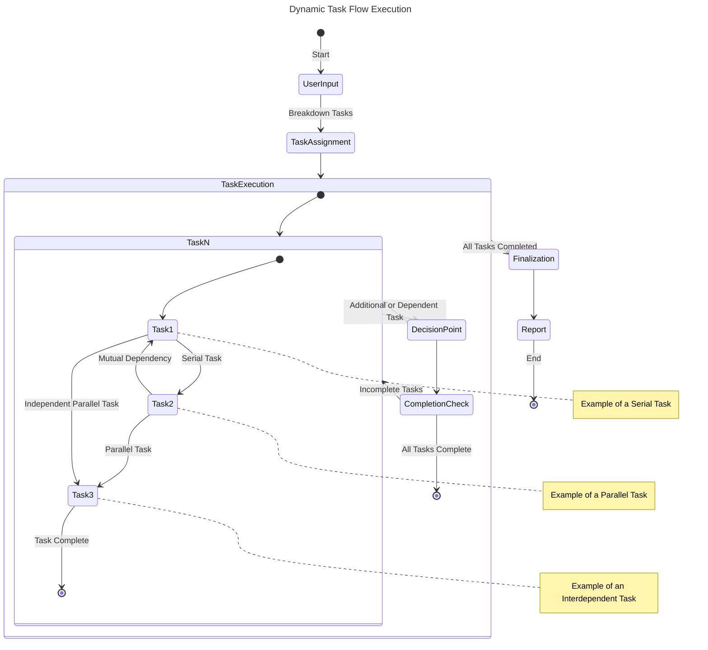
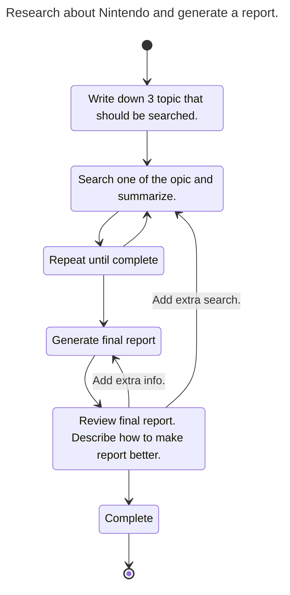

# llmermaid

```mermaid
---
title: Dynamic Task Flow Execution
---
stateDiagram-v2
  [*] --> UserInput: Start
  UserInput --> TaskAssignment: Breakdown Tasks
  TaskAssignment --> TaskExecution
  TaskExecution --> Finalization: All Tasks Completed
  Finalization --> Report
  Report --> [*]: End

  state TaskExecution {
    [*] --> TaskN
    TaskN --> DecisionPoint
    DecisionPoint --> TaskN: Additional or Dependent Task
    DecisionPoint --> CompletionCheck
    CompletionCheck --> TaskN: Incomplete Tasks
    CompletionCheck --> [*]: All Tasks Complete
  }

  state TaskN {
    [*] --> Task1
    Task1 --> Task2: Serial Task
    Task2 --> Task3: Parallel Task
    Task3 --> [*]: Task Complete
    Task1 --> Task3: Independent Parallel Task
    Task2 --> Task1: Mutual Dependency
    note right of Task1: Example of a Serial Task
    note right of Task2: Example of a Parallel Task
    note right of Task3: Example of an Interdependent Task
  }
```

## Example

```mermaid
---
title: Research about Nintendo and generate a report.
---
stateDiagram-v2
[*] --> A
A --> B
B --> C
C --> B
C --> D
D --> E
E --> F
E --> B : Add extra search.
E --> D : Add extra info.
F --> [*]

A: Write down 3 topic that should be searched.
B: Search one of the opic and summarize.
C: Repeat until complete
D: Generate final report
E: Review final report. Describe how to make report better.
F: Complete
```
